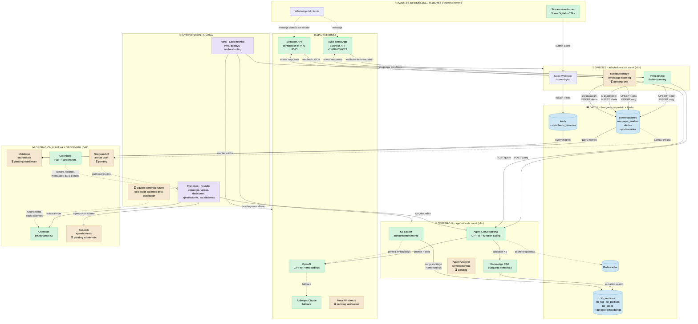

# Arquitectura eXcalando

> Documento vivo · última actualización: 2026-05-17
>
> Para **nuevos integrantes** del equipo: este es el mapa completo de cómo opera la agencia.
> Lee primero la sección **"Filosofía"**, luego mira el **diagrama**, luego volvé a las secciones que te apliquen según tu rol.

---

## Filosofía operacional

**Premisa de fondo:** eXcalando es una **agencia digital autogestionada por agentes IA**. El humano interviene solo cuando es estrictamente necesario.

Esto implica:

- **Por defecto, la IA decide y actúa.** Atiende clientes, califica leads, agenda reuniones, genera contenido, manda reportes.
- **El humano interviene cuando:**
  - La IA explícitamente escala (`escalar_a_humano`)
  - Hay decisión estratégica de negocio (pricing, partnerships, nuevos productos)
  - Hay revisión legal o financiera (contratos, pagos)
  - El cliente pide hablar con persona explícitamente
  - Aparece un caso que la KB no cubre (después se agrega a la KB)
- **Lo que NO hacemos:** humano leyendo cada mensaje, humano contestando WhatsApp, humano armando reportes a mano, humano generando contenido desde cero.

**Si una tarea se hace más de 3 veces a mano, hay que automatizarla.** Esa es la regla.

---

## Diagrama de arquitectura



**Leyenda visual:**
- 🟢 Verde — funcional y vivo en producción
- 🟡 Amarillo — pendiente de implementar
- 🟣 Morado — intervención humana
- 🔵 Azul — capa de datos

---

## Recorrido típico: cliente nuevo entra por WhatsApp

```
1. Cliente potencial encuentra el sitio excalando.com (Google, redes, recomendación)
2. Click en "Chatear ahora" (botón flotante) o "Hablemos por WhatsApp" (CTA)
3. Se abre WhatsApp con mensaje pre-rellenado hacia +1 618 405 6029
4. Cliente envía → Twilio recibe
5. Twilio dispara webhook POST a https://n8n.lithv.net/webhook/twilio-incoming
6. Twilio Bridge (n8n):
   a. UPSERT conversaciones por whatsapp_number (crea si nuevo, actualiza si existe)
   b. INSERT mensajes_analisis con el texto del cliente
   c. Llama a Agent Conversational con {message, contact_phone, contact_name, conversacion_id}
7. Agent Conversational (n8n):
   a. Consulta Knowledge RAG con la query del cliente
   b. RAG genera embedding via OpenAI, busca en kb_servicios con pgvector
   c. Retorna top 3 servicios relevantes con similarity > 0.3
   d. Conversational arma prompt: system + contexto KB + historial + mensaje
   e. Llama a GPT-4o con tools=[escalar_a_humano]
   f. Si GPT decide responder normal → texto coherente
   g. Si GPT decide escalar → llama tool con {motivo, urgencia}
   h. Retorna respuesta + metadata (tool_called, needs_human_review, etc.)
8. Twilio Bridge:
   a. UPDATE conversaciones SET ai_handled_count + 1
   b. Si fue escalación → INSERT alerta con conversacion_id vinculado
   c. (Futuro) Bot Telegram notifica push a Francisco
   d. Envía respuesta vía Twilio API → cliente recibe en su WhatsApp
9. Listo. Toda la cadena toma 3-5 segundos.

Sin intervención humana en este flujo.
Humano entra solo si: GPT llamó escalar_a_humano, o si alerta queda sin atender.
```

---

## Capas explicadas

### 1. Canales de entrada

| Canal | Estado | Volumen esperado |
|---|---|---|
| WhatsApp vía Twilio (+1 618 405 6029) | ✅ Producción | Inicialmente bajo, escala con tracción |
| WhatsApp vía Evolution (+57 321 471 0437) | ⏳ Esperando vincular chip | Backup / alternativa más barata |
| Web - Score Digital | ✅ Producción | 4 leads/semana objetivo inicial |
| Web - CTAs directos | ✅ Producción | — |

**Por qué dos canales WhatsApp:** Twilio es oficial Meta (cero riesgo) pero cuesta. Evolution es gratis pero no-oficial (riesgo bajo de baneo). Tenemos ambos para resiliencia y para optimizar costos cuando crezca el volumen.

### 2. Bridges (adaptadores)

Cada canal habla un "idioma" distinto. Los bridges traducen al formato que el cerebro espera. Esto permite:

- **Cambiar de proveedor de WhatsApp sin tocar el cerebro** (ej: migrar de Twilio a Meta directo cuando termine la verificación)
- **Sumar canales nuevos fácilmente** (Telegram, Instagram DMs, web chat propio) sin reescribir lógica de negocio

Cada bridge es un workflow de n8n. Mismo cerebro, distinto bridge.

### 3. Cerebro IA (channel-agnostic)

El **Agent Conversational** es el único punto donde vive la "personalidad de eXcalando" y las reglas de negocio.

- **System prompt** define identidad, tono, qué hacer, qué no hacer, cuándo escalar
- **Function calling** le da al GPT-4o herramientas que puede invocar (`escalar_a_humano` ya implementado; futuro: `agendar_reunion`, `registrar_oportunidad`)
- **RAG** le da contexto fresco de qué servicios ofrece, precios, FAQs, políticas
- **No tiene estado** — cada llamada es stateless. El historial se reconstruye desde Postgres si hace falta.

**Lo que NO hace el cerebro:**
- No accede directo a Postgres (lo hace el bridge)
- No envía mensajes al cliente (lo hace el bridge)
- No sabe qué canal usó el cliente (los bridges normalizan)

### 4. Datos (Postgres + Redis)

**Tablas principales:**

| Tabla | Función |
|---|---|
| `kb_servicios` | Catálogo de servicios con descripciones + precios + embeddings |
| `kb_faq` | Preguntas frecuentes (⏳ pendiente cargar contenido) |
| `kb_politicas` | Políticas internas (formas de pago, garantías, etc.) (⏳ pendiente) |
| `kb_casos` | Casos de éxito (se llenan post-cliente real) |
| `conversaciones` | Un row por hilo de WhatsApp (cliente único por número) |
| `mensajes_analisis` | Cada mensaje individual + análisis del Analyzer |
| `alertas` | Disparadas por escalaciones del Conversational |
| `oportunidades` | Señales de venta detectadas en conversaciones |
| `leads` | Leads del Score Digital con score + plan recomendado |

**Vistas:** `conversaciones_activas`, `alertas_pendientes`, `oportunidades_abiertas`, `leads_resumen` — alimentan Metabase.

**Redis:** cache + colas para procesos asíncronos.

### 5. APIs externas

- **OpenAI GPT-4o** — modelo principal del Conversational y del Analyzer
- **OpenAI text-embedding-3-small** — embeddings para el RAG
- **Anthropic Claude Sonnet** — fallback si OpenAI cae
- **Twilio WhatsApp Business API** — canal principal de WhatsApp hoy
- **Evolution API** — canal alternativo (gratis, no-oficial)
- **Meta WhatsApp Business API directo** — futuro cuando termine verificación

### 6. Operación humana y observabilidad

| Tool | Para qué | Estado |
|---|---|---|
| Chatwoot | Ver hilos de WhatsApp, intervenir manualmente, asignar a humano | ✅ |
| Metabase | Dashboards de leads, conversaciones, alertas, ROI | ⏳ falta subdomain |
| Cal.com | Agendamiento de reuniones con prospectos | ⏳ falta subdomain |
| Gotenberg | Generar PDFs de reportes mensuales para clientes | ✅ |
| Bot Telegram | Push notification a Francisco cuando hay alerta crítica | ⏳ pendiente |

---

## Roles humanos (matriz)

| Rol | Quién hoy | Responsabilidades | Cuándo crece esto |
|---|---|---|---|
| **Founder / Estrategia** | Francisco | Decisiones de negocio, ventas, vocería, aprobaciones, primera revisión de alertas | Permanente |
| **Tech / Infra** | Harol | VPS, despliegues, debugging, escalado técnico, nuevos workflows | Permanente |
| **Comercial junior** | — (futuro) | Atender SOLO leads calientes post-escalación, agendar y cerrar | Mes 4-6 según volumen |
| **Copywriter / Content** | — (futuro) | Editar drafts del Agente Content Generator (cuando exista) | Mes 6+ |
| **Diseñador** | — (futuro) | Custom design para clientes que lo paguen | Cuando aparezca demanda |

**Lo que NUNCA contratamos** (la IA lo cubre):
- Atención WhatsApp full-time (la cubre el Agent Conversational)
- Analista para hacer reportes (los genera el Reporting Agent + Gotenberg)
- Community manager full-time (lo genera el Content Generator)
- Recepcionista para agendar (lo hace el Conversational + Cal.com)

---

## Infraestructura física

| Componente | Dónde | Notas |
|---|---|---|
| **VPS Hostinger** | `62.72.27.80` | Single VPS, todo containerizado |
| **CyberPanel + OpenLiteSpeed** | El mismo VPS | Sirve frontends estáticos (excalando.com) |
| **Docker network compartida** | `shared-network` | n8n, Evolution, Gotenberg, Postgres, Redis, Chatwoot, etc. todos hablan por nombre |
| **Postgres compartido** | Container `shared_postgres` | Base `agencia_digital` con todo el estado del bot |
| **Redis compartido** | Container `shared_redis` | Cache + colas |
| **Repositorio código** | `github.com/Ovallejf1971/excalando` | Workflows JSON + frontend + docs |
| **Dominio** | `excalando.com` (vía Hostinger DNS) | SSL Let's Encrypt automático |

---

## Costo operativo mensual (estimado a 1000 conversaciones/mes)

| Concepto | Costo USD/mes |
|---|---|
| VPS Hostinger | ~$15 |
| OpenAI (GPT-4o + embeddings) | $25-40 |
| Twilio WhatsApp Business | $0 hasta 1000 conv/mes (free tier), después $0.01-0.05 por conv |
| Anthropic (fallback, raramente activo) | $0-5 |
| Dominio + SSL | $0 (incluido) |
| **Total estimado** | **~$45-65 USD/mes** |

**Comparativo:** un humano atendiendo full-time WhatsApp en Colombia cuesta ~$400 USD/mes y solo trabaja 8h/día. La IA atiende 24/7 a ~$45-65/mes. **Ahorro: 86%.**

---

## Para nuevos integrantes — primer día

### Si sos comercial

1. Lee este doc completo (15 min)
2. Hacé el Score Digital en `excalando.com` para entender la puerta de entrada (5 min)
3. Mandate un mensaje al WhatsApp `+1 (618) 405-6029` y conversá con el bot (10 min)
4. Lee el `pitch-deck.md` en `docs/sales/`
5. Lee los 4 one-pagers para conocer los servicios al detalle
6. Vas a recibir SOLO leads calientes después de que la IA los califique. No tenés que atender mensajes iniciales.

### Si sos técnico

1. Lee este doc completo (15 min)
2. Lee `CLAUDE.md` del repo para convenciones de código del frontend
3. Lee `docs/infraestructura-instalada.md` para mapa del VPS
4. Lee `docs/agentes-ia-stack.md` para los workflows IA detallados
5. Acceso al VPS lo gestiona Harol
6. Acceso a n8n (`https://n8n.lithv.net`) lo gestiona Francisco
7. Para sumar un workflow nuevo: ramada en git → JSON en `integrations/n8n/` → commit → import desde URL en n8n

### Si sos contenido/copy

1. Lee este doc completo (15 min)
2. Lee `.agents/product-marketing-context.md` (el ADN de marca: arquetipo, tono, manifiesto)
3. Lee `docs/decisiones-estrategicas-2026-05-05.md` para entender por qué se tomaron las decisiones de marca
4. Tu trabajo NUNCA es crear desde cero — siempre editás drafts que el Agent Content Generator te entrega

---

## Cuando algo falla

| Síntoma | Primera mirada | Quién |
|---|---|---|
| El bot no responde en WhatsApp | `n8n.lithv.net` → executions de `Twilio Bridge` | Harol |
| El bot responde mal (incoherente, inventa cosas) | Revisar `kb_servicios` (¿cargada?) + Agent Conversational prompt | Francisco + Harol |
| El sitio está caído | `curl https://excalando.com` desde otra red. Si 503/502 → CyberPanel | Harol |
| Alerta no llegó a Telegram | Revisar tabla `alertas` en Postgres + workflow Telegram | Harol |
| Cliente reclama por algo legal/contractual | Escalación inmediata a Francisco. NO responder sin él. | Cualquiera → Francisco |

---

## Glosario para no técnicos

- **Workflow:** una secuencia automatizada de pasos en n8n. Recibe algo (un mensaje, un webhook, un cron), hace cosas con eso, devuelve algo.
- **Webhook:** una URL que recibe peticiones HTTP. Cuando algo le manda datos, se dispara el workflow asociado.
- **n8n:** el "sistema operativo" de nuestras automatizaciones. Pensalo como Zapier/Make pero open-source y self-hosted.
- **KB (Knowledge Base):** la base de conocimiento que el bot consulta para responder. Hoy tiene 10 servicios + sus precios. Faltan FAQs y políticas.
- **RAG (Retrieval Augmented Generation):** técnica donde el modelo de IA consulta una KB antes de responder, en vez de inventar desde su memoria. Reduce errores.
- **Embeddings:** representación numérica de un texto (lista de 1536 números). Textos con significado parecido tienen embeddings parecidos. Es lo que permite la "búsqueda semántica".
- **Bridge:** workflow adaptador entre un canal (WhatsApp, web, email) y el cerebro. Traduce formatos.
- **Postgres / Redis:** bases de datos. Postgres guarda lo importante (conversaciones, leads). Redis guarda lo temporal (cache).
- **VPS:** Virtual Private Server. Una computadora en la nube donde corre todo nuestro sistema.

---

## Cómo evoluciona esta arquitectura

**Mes 1-3 (validación, donde estamos hoy):**
- WhatsApp + Web operando
- 1 agente conversacional + 1 RAG + Bridges
- Francisco aprueba escalaciones, Harol mantiene infra

**Mes 4-6 (cuando hay 8-12 clientes activos):**
- Sumar Agente Analyzer (corre en paralelo, analiza sentiment/intent)
- Sumar Agente Lead Qualification (califica leads del Score automáticamente)
- Activar Modo Autopilot temático en Conversational
- Metabase + Cal.com en vivo
- Primer comercial humano (atiende solo leads `priority=hot`)

**Mes 6-12 (escalado):**
- Sumar Content Generator (LinkedIn + Instagram drafts)
- Sumar Newsletter Agent (mensual)
- Sumar Reactivation Agent (recupera leads dormidos)
- Sumar Proposal Generator (PDFs personalizados por lead caliente)
- Sumar Onboarding Agent (acompaña primeros 30 días del cliente)
- Considerar Meta API directa (más barato a escala que Twilio)

**Mes 12+:**
- Multi-cliente: cada cliente que contrata el Recepcionista WhatsApp tiene su propia instancia con su KB
- Templates reutilizables para acelerar entregas
- Posible producto SaaS derivado (el propio Score Digital como herramienta vendible)

---

**Cualquier duda sobre este documento → Francisco** (`ovallejf@gmail.com` · WhatsApp interno equipo).
